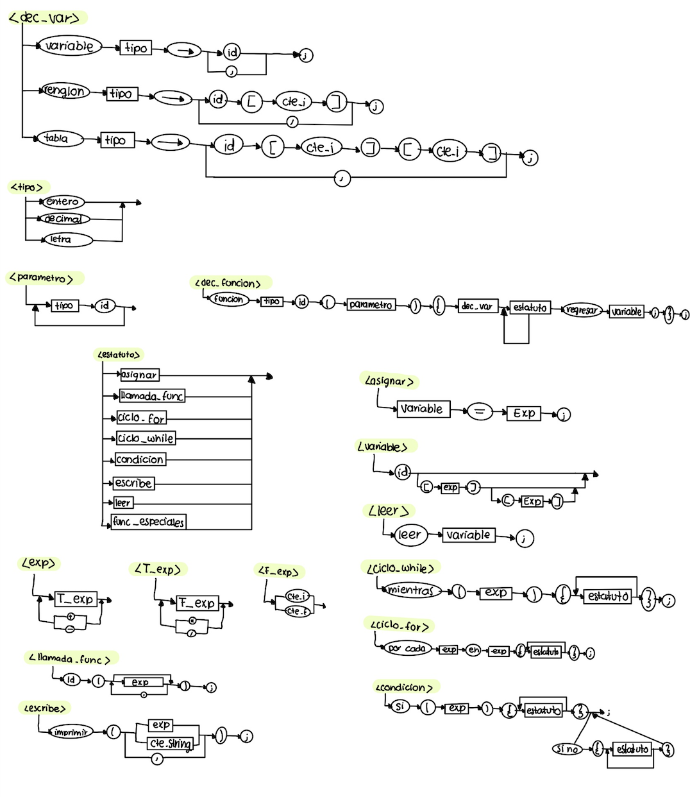
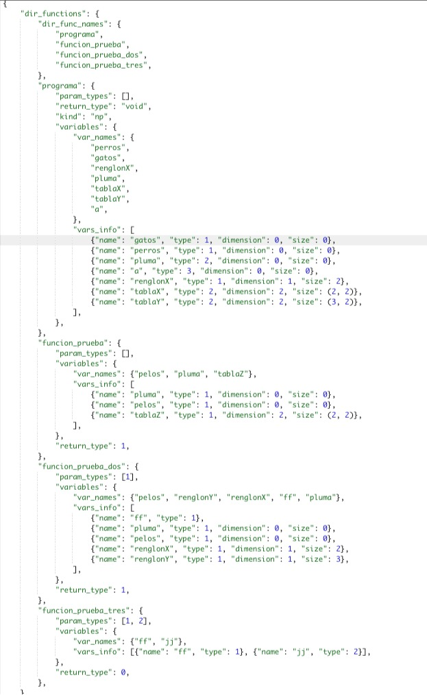
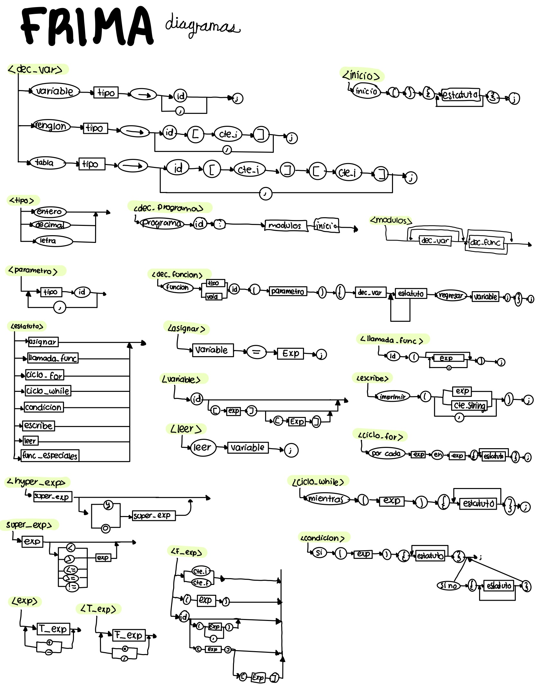
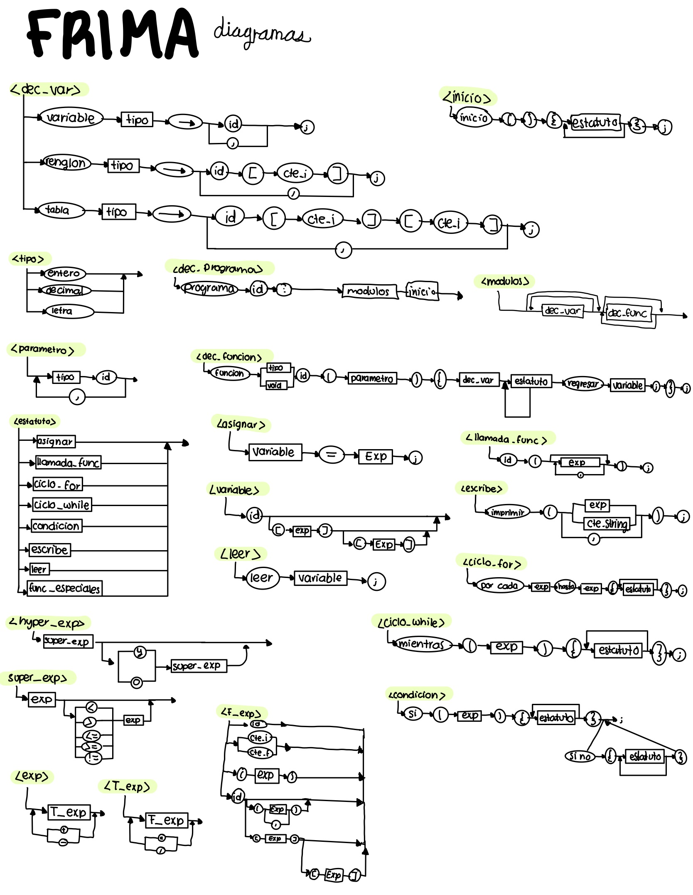

<h1>  $${\color{gray} FRIMA}$$ </h1> 
María Renée Benavides Puente A01139495

Frida Gutíerrez Mireles A01039975
 

<h2> Objetivo </h2>
El objetivo es acercar al área de programación a gente que no tiene conocimientos técnicos y se les dificulta el idioma Inglés. 


<h2> Funciones  especiales </h2>

-Diseñado en idioma Español

-Funcionara en dispositivos móviles tanto iOS como Android

-Generará, compilará y ejecutará archivos 


<h2> Principales características de semántica </h2> 

-Se podrán hacer las operaciones aritméticas entre números enteros y decimales.

-Las funciones regresarán y permitirán como parámetros los siguientes datos primitivos: enteros y decimales.

-El tamaño de los arreglos y matrices serán de tamaño entero.

-Los arreglos y matrices aceptarán expresiones aritméticas para acceder a sus valores.

<h2>  Desarollo </h2> 

<h3> Frontend </h3>

-React Native para tenerlo disponible para iOS y Android

<h3> Backend (compilador) </h3>

-Python con PLY


<h1>  ${\color{gray} Avance  }$  ${\color{gray} 1  }$</h1> 
Abril 16, 2023

Dentro del repositorio se podrá encontrar en Léxico y Sintaxis de FRIMA. Todo fue hecho con base a los diagramas mostrados a continuación. 



<h1>  ${\color{gray} Avance  }$  ${\color{gray} 2  }$</h1> 
Abril 23, 2023

Dentro del repositorio se podrá encontrar la semántica básica de variables, la cuál tiene su directorio de procedimientos y tablas de variables. Además, se agregó la semántica básica de expresiones, que esta compuesta por su tabla de consideraciones semánticas es decir, el cubo semántico.

A continuación se puede ver una imagen de lo que se detecta al correr el siguiente ejemplo: 

```ruby
programa pruebaUno:
variable entero -> gatos, perros;
variable decimal -> pluma, pelos;
variable letra -> a, b, c;

renglon entero -> renglonX[2], renglonY[3];
tabla decimal -> tablaX[2][2], tablaY[3][2];

funcion entero funcion_prueba(){
   variable entero -> pluma, pelos;
   tabla entero -> tablaZ[2][2];

   regresar pluma;
};

funcion entero funcion_prueba_dos(entero ff, decimal jj){
   variable entero -> pluma, pelos;
   renglon entero -> renglonX[2], renglonY[3];

   regresar pluma;
};

funcion sinregresar funcion_prueba_tres(entero ff, decimal jj){

   regresar pluma;
};

inicio(){

};
```




<h1>  ${\color{gray} Avance  }$  ${\color{gray} 3  }$</h1> 
Abril 30, 2023

Desarrollo de la semántica para la creación de cuádruplos para las expresiones aritmeticas y estatutos lineales. Se agregaron y modificaron los respectivos diagramas que se pueden ver a continuación:





<h1>  ${\color{gray} Avance  }$  ${\color{gray} 4  }$</h1> 
Mayo 7, 2023

Desarrollo de la semántica para la creación de cuádruplos para los estatutos condicionales de decisión y ciclos. 
-Ciclo For (Por cada - hasta)
-Ciclo While (Mientras)
-Condición If y If else (Si - Si no)

Se modificó el diagrama del Ciclo For que se puede ver en la siguiente imagen:


<h1>  ${\color{gray} Avance  }$  ${\color{gray} 5  }$</h1> 
Mayo 14, 2023

Desarrollo de semántica para la creación de cuádruplos de funciones. 


